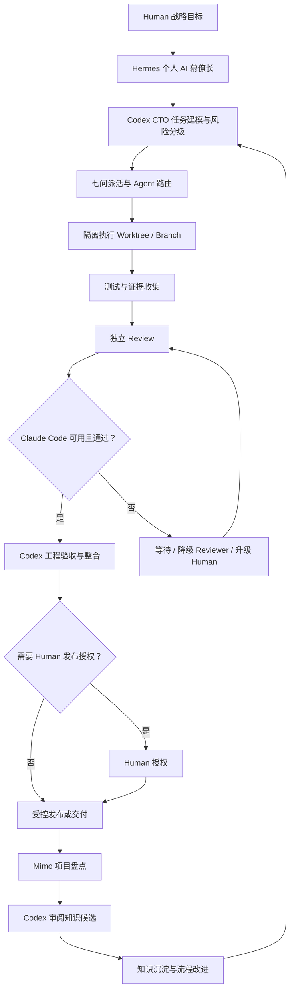

# AI Software Engineering Workflow

## 1. 总体目标

本流程把软件工程 AI 团队组织成一个可追踪的闭环：



Codex 在整个生命周期中维护任务状态，持续掌握子 Agent 的进度、阻塞、风险和决策记录。子 Agent 是专业执行单元，不是自治的项目管理者。

## 2. 角色协作模型

```text
Human：定义战略、授权重大风险和不可逆动作
  ↓
Hermes：整理个人目标、优先级、背景和跨域依赖
  ↓
Codex：工程拆解、派活、状态管理、技术决策、整合和发布编排
  ↓
专业 Agent：实现、测试、分析、审查
  ↓
Claude Code：关键任务最终独立验收
  ↓
Mimo：完成后盘点，Codex 审阅并沉淀知识
```

Hermes 和 Codex 的边界：Hermes 负责“人要实现什么以及优先级如何协调”；Codex 负责“软件工程如何可靠完成”。Hermes 不绕过 Codex 直接指挥代码合并或发布；Codex 也不替 Human 做战略和不可逆授权。

## 3. 生命周期阶段

### Phase 0：目标接收与任务登记

**输入**：Human 的目标，或 Hermes 整理后的任务意图。

**Codex 动作**：

- 识别背景、目标、非目标、成功标准和约束；
- 检查目标目录、已有文档、交接信息和当前状态；
- 标记缺失信息、潜在冲突和依赖；
- 生成唯一 `dispatch_id`，建立 Task State。

**输出**：Task Brief、初始状态 `PLANNED`。

**门禁**：目标或范围不清时转为 `NEEDS_CLARIFICATION`，不进入并行执行。

### Phase 1：风险分级与验收设计

Codex 判断任务是 L1、L2 还是 L3，并提前定义：

- 验收人和验收层级；
- 是否需要 Claude Code；
- Claude 不可用时的等待、降级和升级策略；
- 是否需要 Human 授权；
- 测试范围、证据要求和停止条件。

**输出**：Risk Record、Acceptance Plan。

### Phase 2：任务拆解与 Agent 路由

Codex 将目标拆为边界清晰、可独立验证的子任务。每个子任务必须有：

- 唯一编号和单一负责人；
- 输入、输出、允许修改路径；
- 依赖和并行关系；
- 验收标准；
- 主 Agent、Reviewer 和替代方案；
- Worktree/Branch/Context 计划。

**输出**：Dispatch Records，状态 `DISPATCHED`。

### Phase 3：上下文准备与隔离执行

Codex 向 Agent 提供最小必要上下文，包括任务目标、相关文件、约束、接口、测试命令和输出格式。

代码修改任务默认采用独立 Worktree 或 Branch。并行结构可以是：

```text
main
├── codex/task-001-architecture
├── agent/task-002-implementation
└── agent/task-003-tests
```

每个 Agent 在自己的范围内工作，不得覆盖别人的变更，不得擅自修改主分支策略，不得访问未授权目录或敏感材料。

**输出**：实现补丁、分析报告、测试或验证证据，状态 `IN_PROGRESS`。

### Phase 4：进度汇报与状态控制

子 Agent 在开始、阶段完成、阻塞、发现风险、方向纠偏和最终完成时向 Codex 汇报。Codex 更新：

- `current_phase`；
- `owner`；
- `completed`、`in_progress`、`pending`；
- `blocked`；
- 风险等级和影响；
- 下一步和更新时间；
- 各 Agent 之间的分歧与决策。

Agent 只能建议纠偏，Codex 负责判断继续、重拆、换路由、增加 Reviewer 或暂停。需求战略变化必须回到 Human 或 Hermes 确认。

### Phase 5：集成前验证

执行 Agent 必须在自己的隔离环境中完成：

- 单元测试、集成测试或适用的验证；
- 静态检查、构建和格式检查；
- 边界条件与失败路径检查；
- 变更摘要、证据路径和残余风险记录。

测试不能只报告“成功”，应记录命令、范围、结果和未覆盖区域。验证失败时，状态转为 `BLOCKED` 或 `NEEDS_DIRECTION`，由 Codex 决定修复或重新派活。

### Phase 6：独立 Review

Reviewer 不重复执行者的自我评价，而是独立检查：

- 是否满足目标和非目标；
- 架构是否与约束一致；
- 代码质量、可维护性和回归风险；
- 安全、权限、数据和外部接口；
- 测试是否足以支持结论；
- 是否存在未记录的假设或隐含副作用。

L1 可以由 Codex 自检；L2 默认使用 DeepSeek、Qwen 3.8 或其他已授权 Reviewer；CodeBuddy GLM 5.2 只有在 Claude 限额且 Human 明确批准后进入应急路径；L3 由 Claude Code 进行最终独立验收。K3 仅为实验性 Agent，不得自动进入路由。Review 输出必须包含证据、问题等级、修改建议和 `ACCEPT / MODIFY / BLOCK`。

### Phase 7：验收、冲突解决与整合

Codex 汇总执行结果和 Review 报告，处理分歧并做工程决策：

1. `ACCEPT`：满足标准，进入整合；
2. `MODIFY`：退回执行 Agent，保留原 Review 意见；
3. `BLOCK`：暂停交付，补充设计、测试、权限或 Human 决策；
4. `ESCALATE`：存在战略、合规、不可逆或无法解决的关键冲突，提交 Human。

整合前确认 Branch 基础、变更范围、冲突状态和全部验证结果。Codex 负责合并顺序和冲突解决；任何冲突解决都应重新运行受影响的测试。

### Phase 8：发布或交付

发布前检查：

- 验收报告和测试证据齐全；
- 变更范围与授权一致；
- 生产、外部发送、数据迁移、权限变更等高风险动作已获得所需授权；
- 回滚方式、影响范围和责任人明确；
- Claude Code 不可用时的降级情况已显式记录。

没有满足发布门禁时，只能交付为“候选结果”或“待人工验收”，不能用语言包装成已完成。

### Phase 9：项目盘点与知识回流

交付后由 Mimo 进行独立盘点，内容包括：

- 目标、计划和实际结果；
- 关键决策及其证据；
- Agent 分工、路由效果和额度/可用性问题；
- 失败、返工、阻塞和最终解决方式；
- 可复用的模板、检查清单、路由规则和测试策略；
- 尚未核实的假设和后续行动。

Codex 复核 Mimo 结果，确认来源、日期、上下文、适用范围和事实等级。知识回流只保存蒸馏后的稳定结论，不保存整段对话、密码、Token、私钥或敏感原始材料。冲突内容保留为待审阅项，未经确认不得升级为团队规范。

## 4. 统一状态机

| 状态 | 含义 | 责任动作 |
|---|---|---|
| `PLANNED` | 已登记，尚未派活 | Codex 补齐七问和验收标准 |
| `NEEDS_CLARIFICATION` | 目标、范围或输入不清 | 向 Hermes/Human 获取澄清 |
| `DISPATCHED` | 已明确 Agent、上下文和隔离方式 | Agent 开始执行 |
| `IN_PROGRESS` | 正在执行 | Agent 汇报，Codex 维护状态 |
| `BLOCKED` | 被依赖、权限、测试或资源阻塞 | 保留证据，Codex 决定等待、换路由或升级 |
| `NEEDS_DIRECTION` | 发现需求或技术方向风险 | Codex 纠偏；战略变化交 Human |
| `REVIEWING` | 已完成执行，等待独立审查 | Reviewer 输出报告 |
| `NEEDS_HUMAN_APPROVAL` | 命中人工确认触发器 | 暂停不可逆或外部动作 |
| `ACCEPTED` | 验收通过 | Codex 准备整合 |
| `INTEGRATED` | 已安全整合 | 运行整合后验证 |
| `RELEASED` | 已按授权交付或发布 | 记录版本和回滚信息 |
| `CLOSED` | 已完成盘点和知识回流 | 归档证据与最终状态 |

## 5. 异常与降级处理

### Claude Code 不可用

Codex 根据风险判断三种路径：

- **等待**：任务重要性高、额度恢复可预期，保持 `BLOCKED` 或 `REVIEWING`；
- **降级**：先取得 Human 明确批准，再使用 CodeBuddy GLM 5.2，并增加测试、双审或 Human 复核；K3 仅可作为单独实验，不是自动替代。
- **升级**：风险、影响或授权边界无法由现有 Reviewer 覆盖，提交 Human 决策。

每次降级必须留下记录，不得把替代结果伪装成 Claude Code 已验收。若没有明确批准，只能等待或保持 `REVIEWING/BLOCKED`。

### Agent 方向错误

停止继续扩大变更；保存当前证据和已完成结果；由 Codex 重新判断是修改任务、回滚局部变更、补充上下文、换 Agent 还是升级 Human。不得因“已经做了一部分”而继续错误方向。

### 多 Agent 结论冲突

要求各方分别提交假设、证据、验证命令和风险。Codex 先区分定义冲突、数据冲突和价值取舍，再决定补充实验、采用方案、组合方案或升级。不得以简单投票替代技术判断。

### 测试失败或证据不足

结果保持在 `BLOCKED` 或 `MODIFY`，记录失败命令、错误、影响和复现步骤。只有完成修复并重新验证后，才能回到 `REVIEWING`。

## 6. Definition of Done

一个软件工程任务只有满足以下全部条件，才算真正完成：

- 目标和非目标明确，交付物位于授权范围；
- 七问派活记录完整；
- 任务状态和 Agent 进度可追溯；
- 修改、测试和验证证据齐全；
- 独立 Review 已完成，问题有明确处置；
- 所需的 Claude Code 验收或降级说明已完成；
- 分支已安全整合，受影响测试已重跑；
- 发布、外部调用或不可逆动作已获得必要授权；
- Mimo 已完成项目盘点，Codex 已审阅知识候选；
- 未解决风险、后续行动和责任人已记录。

## 7. 最小闭环检查清单

```text
[ ] Human/Hermes 目标已转化为可执行 Task Brief
[ ] Codex 完成风险分级和验收设计
[ ] 七问派活记录完整
[ ] Agent、Reviewer、Fallback 和隔离范围已确定
[ ] 子 Agent 按节点汇报，Codex 持续维护状态
[ ] 测试、构建、静态检查或其他验证已记录
[ ] 独立 Review 已完成并处理意见
[ ] Claude Code 可用性或降级决策已记录
[ ] 分支冲突已处理，整合后验证已重跑
[ ] 高风险/不可逆动作已取得人工授权
[ ] 交付结果、风险和回滚方式已记录
[ ] Mimo 盘点完成，Codex 审阅并沉淀可复用知识
```
