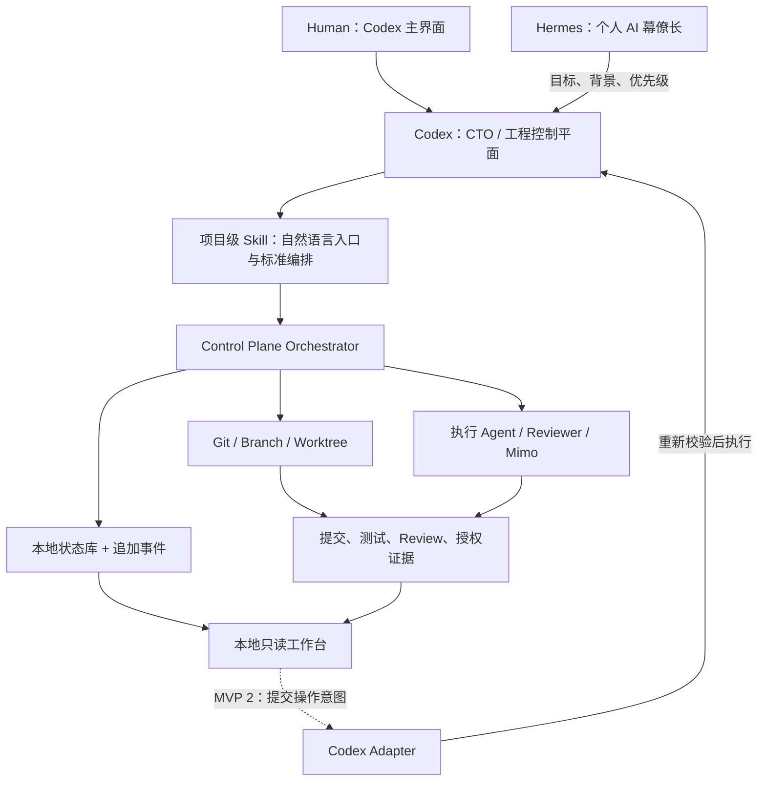
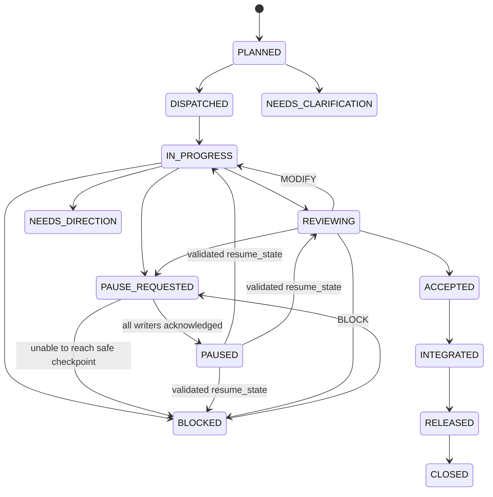

# AI 软件工程团队控制平面设计

> 状态：待 Human 设计确认
>
> 日期：2026-08-08
>
> Owner：Codex
>
> 实施顺序：MVP 0 → MVP 1 → MVP 2 → MVP 3

## 1. 结论

采用“Codex 主入口 + 项目级 Skill + 本地状态控制平面 + 只读前端工作台”的渐进式架构。

- Human 始终从 Codex 发起软件工程任务，不要求使用 VS Code 或 CLI。
- Codex 是唯一工程控制平面，负责七问派活、Git/Worktree、Agent 路由、冲突处理、验收编排和状态维护。
- 项目级 Skill 把重复操作封装成自然语言可触发的标准工作流。
- MVP 1 前端只读，只展示状态、阶段、Agent、审批和证据，不直接执行 Git 或 Agent 动作。
- MVP 2 才增加双向适配器；前端提交的是“操作意图”，Codex 重新校验后执行。
- MVP 3 仅在多项目、长期队列和高频交互确有需求时建设完整客户端，不提前投入。

该方案在易用性和控制权之间保持清晰边界：用户看得见，Codex 管得住，底层动作可审计。

## 2. 目标与非目标

### 2.1 目标

1. 用户只需在 Codex 中用自然语言启动、查询、暂停、继续和批准任务。
2. 将现有七问派活协议、角色矩阵、软件生命周期和 Git 治理转为可执行机制。
3. 为每个任务建立统一、可恢复、可审计的状态与证据链。
4. 为并行 Agent 提供独立 Worktree，避免代码冲突和上下文污染。
5. 提供本地前端工作台，显示任务进展和所有需要 Human 介入的节点。
6. 保留后续接入 Codex App Server 和完整自定义客户端的演进路径。

### 2.2 非目标

- MVP 0 不建设前端，也不做远程部署。
- MVP 1 不允许从前端直接修改 Git、调用 Agent、合并或发布。
- 本轮不配置 GitHub Remote；GitHub 是独立实施任务，需要明确账户、组织、仓库名、可见性和认证方式。
- 不让 Hermes 接管软件工程控制权。Hermes 只负责跨域意图和优先级协调。
- 不让子 Agent 自行扩大权限、修改主线或绕过 Codex。
- 不把 SQLite、MinIO 或任何单一服务设为不可替代的事实源。

## 3. 设计原则

### 3.1 单一授权、分层写入、多读者

- **唯一授权与工程决策者**：Codex。只有 Codex 可以批准状态转换、Agent 派活、主线操作、整合和发布编排。
- **SQLite 唯一物理写者**：Control Plane Orchestrator。其他组件只能向它提交带幂等键的状态变更请求。
- **代码写入者**：每个 Worktree 同一时刻只能有一个被派活 Agent；Agent 仅能写所属路径和短生命周期分支。`main`、合并和 Worktree 管理由 Codex 独占。
- **受控执行器**：项目脚本只执行 Codex 已授权且参数校验通过的确定性动作，不拥有决策权。
- **只读消费者**：MVP 1 工作台、Reviewer、盘点 Agent。
- **Human**：批准战略、高风险、外部、生产、权限扩大和不可逆动作。

### 3.2 Git 是代码事实源

Git 负责代码、提交、分支、Worktree 和整合历史。运行数据库负责快速查询和交互状态，但不得覆盖 Git 事实。

任何状态记录都必须区分：

- `bootstrap_base_sha`：仓库治理初始化基线；
- `task_base_sha`：某次派活创建时的主线基线；
- `current_head_sha`：当前工作区或主线实际提交。

### 3.3 证据先于结论

“完成”“通过”“已修复”必须关联实际文件、提交 SHA、命令结果、Reviewer 报告或授权记录。进度百分比只作辅助展示。

### 3.4 默认本地、最小权限

MVP 0 和 MVP 1 只访问本地仓库，前端默认绑定 `127.0.0.1`。状态、日志和证据不得保存密码、Token、私钥或敏感原文。

## 4. 总体架构



### 4.1 组件职责

| 组件 | 职责 | 不得做什么 |
|---|---|---|
| Codex | 唯一工程授权和决策者；七问派活、风险分级、路由、Git 管理、纠偏、验收和整合 | 不替 Human 批准战略或不可逆动作 |
| 项目级 Skill | 识别自然语言意图，向 Codex/Orchestrator 提交标准请求 | 不直接写 SQLite，不绕过权限与验收门禁 |
| Control Plane Orchestrator | SQLite 唯一物理写者；执行已授权状态转换，生成派活单、操作日志和证据索引 | 不自行改变业务目标或授权 Git 动作 |
| Git/Worktree 层 | 隔离写入任务，保留可复核代码历史 | 不保存交互状态 |
| 本地状态库 | 保存任务、Agent、阻塞、审批、事件和证据索引 | 不取代 Git 提交事实 |
| 工作台 | 展示项目健康、生命周期、Agent、审批和证据 | MVP 1 不执行写操作 |
| Codex Adapter | MVP 2 接收前端意图，绑定目标状态并交回 Codex | 不直接执行 Git、Agent 或发布 |

## 5. 用户操作体验

用户不需要输入长命令。进入项目后可直接说：

- “进入软件工程团队，帮我实现……”
- “打开工程工作台。”
- “查看当前任务状态和阻塞。”
- “哪些事项在等我批准？”
- “暂停任务 20260808-002。”
- “继续这个任务。”
- “让独立 Reviewer 检查后再合并。”

项目级 Skill 自动完成：

1. 读取 `handoff.md` 与现行协议；
2. 检查仓库、主线和 Worktree 状态；
3. 形成七问派活单、风险等级与验收计划；
4. 创建隔离分支和 Worktree；
5. 调度 Agent 并收集结构化汇报；
6. 运行验证、独立 Review 和必要的 Claude 最终验收；
7. 请求 Human 完成命中的高风险审批；
8. 由 Codex 整合、更新交接并清理安全可清理的 Worktree；
9. 触发 Mimo 盘点，由 Codex 审阅后形成知识候选。

命令行仍保留为底层可复现接口和故障诊断手段，但不是用户日常入口。

## 6. 统一状态与证据模型

### 6.1 存储布局

```text
<git-common-dir>/
└── team/
    └── runtime/
        ├── team.db                # 所有 Worktree 共享的本地运行状态
        └── control-plane.lock     # 单仓库写入锁
<repo>/
├── artifacts/
│   └── dispatches/
│       └── <dispatch-id>/         # 可提交的蒸馏证据与报告
├── .agents/
│   └── skills/
│       └── ai-software-engineering-team/
│           └── SKILL.md
└── scripts/                       # 确定性检查与操作脚本
```

SQLite 是 MVP 的默认本地状态库，因为单机部署简单、无需额外服务、可事务化。运行目录通过 `git rev-parse --git-common-dir` 解析，放在 Git common directory 内，因此主工作区和所有 Worktree 共享同一数据库，且运行状态不会进入提交。所有状态写入只能由 Orchestrator 完成，并经过单仓库锁和数据库事务串行化；工作台只建立只读连接。需要长期保留的结论和证据以 Markdown、JSON 或测试产物摘要写入 `artifacts/dispatches/<dispatch-id>/`。

### 6.2 核心实体

- `projects`：仓库路径、主线、远端、健康状态、最后扫描时间；
- `tasks`：dispatch ID、目标、风险、生命周期状态、负责人、各 SHA、更新时间；
- `agents`：角色、模型、任务、状态、最后汇报时间；
- `events`：追加式状态事件，不原地改写历史；每个项目使用单调递增序号，便于断线续读和重建；
- `approvals`：审批类别、目标动作、目标 SHA、状态、批准者和时间；
- `evidence`：证据类型、路径、摘要、哈希、生成时间和关联 SHA；
- `reviews`：Reviewer、结论、问题等级、证据和验收状态；
- `blockers`：原因、责任人、解除条件和下一步。
- `operations`：跨 Git/SQLite 操作日志，包含 `operation_id`、幂等键、动作、参数摘要哈希、目标 SHA、阶段和复核结果。

### 6.3 状态机



每次转换必须记录 `dispatch_id`、前后状态、原因、操作者、时间、目标 SHA 和关联证据。非法转换必须拒绝并记录错误。

暂停采用两阶段语义：`PAUSE_REQUESTED` 先停止新派活和新 Git 动作，并等待当前写入者到达安全检查点；全部确认后才进入 `PAUSED`。暂停期间只允许健康检查、只读查询、Agent 停止确认、审批记录和证据归档，不允许代码、Git 或业务状态继续推进。任务保存 `resume_state`，恢复前由 Codex 重新校验 Git、锁和阻塞条件。

`NEEDS_HUMAN_APPROVAL` 是可挂载在任何工程动作之前的独立门禁，而不是只发生在验收之后。触发门禁时保存当前生命周期状态，禁止调用执行器；审批必须绑定 `dispatch_id + action/intent + target_sha + request_hash`。批准后 Codex 重新读取实际状态，完全匹配才恢复原阶段并执行一次；拒绝、过期或目标漂移则保持阻塞或回到原阶段重新决策。

### 6.4 恢复策略

Git 和 SQLite 无法形成跨系统原子事务，因此所有会同时影响 Git 与状态库的动作采用可恢复操作日志：

```text
创建 operation_id 与幂等键
→ SQLite 事务写入 PREPARED
→ 使用已校验 argv 执行 Git 动作
→ 重新读取 Git 事实并核对预期后置条件
→ SQLite 事务写入 COMMITTED 或 FAILED
```

启动时及每次新写入前，Orchestrator 必须 reconcile 未完成的 `PREPARED` 操作。若 Git 事实准确证明动作已完成，则补记 `COMMITTED`；若证明未发生，则安全重试或记为 `FAILED`；无法唯一判断时转为 `UNKNOWN/BLOCKED`，不得继续后续写操作。

Codex 管理的 Worktree 创建、合并、移除和分支操作必须走上述操作日志。执行 Agent 在所属 Worktree 内产生的原子提交仍遵循现行 Git 契约；提交本身不直接推进任务状态，Codex 必须读取提交 SHA、差异和证据后，再通过 Orchestrator 完成受控状态转换。这样即使 Agent 在汇报前中断，Git 事实仍可被重新发现，不会被误记为已验收或已整合。

状态库损坏或丢失时：

1. 先从 Git 读取主线、分支、Worktree、提交和工作区状态；
2. 再扫描已提交的派活证据与报告；
3. 重建可确认的状态，无法确认的字段标记 `UNKNOWN`；
4. 不凭推测把任务标为完成、已验收或已发布。

MinIO 不进入 MVP 关键路径。若未来需要保存大体积测试包、截图或构建产物，MinIO 仅作为可替换对象存储；元数据、内容哈希和本地/远端位置保留在证据索引中。MinIO 不可用时任务仍可运行，产物暂存本地并标记待同步；同步后必须校验内容哈希并完成远端读回验证，确认成功前不得自动删除本地唯一副本。磁盘空间不足时停止接收新大文件并显示阻塞，不得静默丢弃证据。

## 7. Worktree Doctor

MVP 0 增加 `worktree-doctor`，用于“检查实际状态后再处理”，分为两个模式：

### 7.1 Inspect

只读检查：

- Worktree 路径是否位于仓库 `.worktrees/`；
- 分支命名、owner、dispatch ID 和 `task_base_sha` 是否一致；
- 工作区是否脏；
- 分支是否有超出基线的提交；
- 是否存在 Git 元数据残留、路径丢失或分支占用；
- 当前任务状态与 Git 事实是否冲突。

### 7.2 Repair

仅在以下条件全部满足时自动修复：

- 目标路径明确位于本仓库 `.worktrees/`；
- 分支、任务和基线可唯一解析；
- Worktree 无未提交修改；
- 分支没有超出 `task_base_sha` 的提交；
- 修复只涉及安全重建、重新关联或清理明确失效的元数据。

任一条件不满足，结果必须为 `BLOCKED`，保留现场并交由 Codex 判断。禁止使用 `git reset --hard`、`git clean -xdf`、无范围删除或 force 操作。

## 8. 前端工作台信息架构

MVP 1 是本地只读控制台，由 Codex 启动或打开，用户不接触命令行。

### 8.1 首页：项目总览

- 仓库健康、主线、当前 HEAD、远端状态；
- 活跃任务、阻塞任务、待审批数量；
- 当前生命周期阶段和最近更新时间；
- 数据来源与快照时间，过期时显著提示。

### 8.2 任务详情

- 目标、非目标、七问派活摘要；
- 生命周期时间线；
- `task_base_sha`、分支、Worktree 和当前提交；
- 验收标准逐项状态；
- 风险、阻塞、下一步和负责人。

### 8.3 Agent 面板

- Agent/模型角色、当前子任务、最后汇报时间；
- 已完成、进行中、发现、风险和建议；
- Reviewer 独立性与验收结论；
- Claude 不可用时的等待或降级状态。

### 8.4 审批队列

- 为什么需要 Human；
- 拟执行动作、影响范围和回滚方式；
- 绑定的 dispatch ID、目标分支和目标 SHA；
- 当前仅显示“请回到 Codex 批准”。MVP 2 才支持从前端提交审批意图。

### 8.5 证据中心

- 提交和差异摘要；
- 测试、构建、静态检查结果；
- Review 报告与未解决问题；
- 文件路径、哈希、时间和生成时的 SHA。

## 9. 接口边界

### 9.1 MVP 0：Skill 意图

建议支持以下内部意图：

- `team.start_task`
- `team.status`
- `team.open_dashboard`
- `team.pause_task`
- `team.resume_task`
- `team.list_approvals`
- `team.review_task`
- `team.integrate_task`
- `team.run_doctor`

Skill 负责把自然语言映射为意图；真正的 Git 和状态操作由可测试的确定性脚本完成。

### 9.2 MVP 1：只读 API

最小接口：

```text
GET /api/project
GET /api/tasks
GET /api/tasks/:dispatch_id
GET /api/tasks/:dispatch_id/events
GET /api/tasks/:dispatch_id/evidence
GET /api/approvals
GET /api/health
```

所有响应包含 `generated_at`、`source_head_sha` 和 `schema_version`。服务端拒绝非 GET/HEAD/OPTIONS 的业务请求，并用测试证明只读边界。数据库使用只读连接打开；服务默认拒绝跨 Origin 访问，不配置通配 CORS。

### 9.3 MVP 2：操作意图 API

MVP 2 可增加：

```text
POST /api/intents
```

请求至少包含：

- `idempotency_key`；
- `dispatch_id`；
- `intent_type`；
- `expected_state`；
- `target_sha`；
- 用户确认文本；
- 一次性 approval nonce；
- 客户端时间和来源。

Adapter 只把意图交给 Codex。Codex 必须重新读取 Git 和任务状态，检查 SHA、权限、审批门禁和幂等性后才能执行。状态已变化或 SHA 不一致时，拒绝旧审批，要求用户重新确认。

审批 schema 至少包含 `nonce_hash`、`expires_at`、`consumed_at`、`request_hash` 和带唯一约束的 `idempotency_key`。校验并消费 nonce、创建 `PREPARED` 执行记录必须在同一 SQLite 事务内完成；事务未提交时不得调用底层执行器。

## 10. MVP 实施路线与验收门

### MVP 0：可复用控制平面基础

**交付物**：

- `.agents/skills/ai-software-engineering-team/SKILL.md`；
- `USER_OPERATING_GUIDE.md`；
- 任务、事件、审批和证据 schema；
- 状态初始化、查询、转换和证据登记脚本；
- `worktree-doctor` 的 inspect/repair 脚本；
- 测试与示例派活记录。

**验收门**：

- 用户通过自然语言可启动任务、查询状态和查看待审批项；
- 自动读取 `handoff.md` 和协议，仓库不健康时停止写入；
- 一个写入任务只对应一个分支、Worktree 和 owner；
- 状态转换可审计，非法转换被拒绝；
- Git/SQLite 跨系统操作可在崩溃后 reconcile，无法确认时 fail closed；
- 暂停必须等待写入者到达安全检查点，暂停后不得继续 Git 或代码写入；
- 执行前审批可挂载在任意高风险动作前，并绑定动作、SHA 和参数摘要；
- doctor 能安全识别健康、可修复和必须阻塞三类场景；
- 不需要 MinIO、云服务或 GitHub 才能运行。

### MVP 1：本地只读工作台

**交付物**：

- 本地后端只读 API；
- 项目总览、任务详情、Agent、审批和证据五类视图；
- Codex 一句话启动/打开工作台的方法；
- 数据过期、服务异常和状态不一致提示。

**验收门**：

- 非技术用户无需 VS Code 或 CLI 即可查看全流程；
- 浏览器界面无法直接修改 Git、状态或调用 Agent；
- 页面显示来源 HEAD 和刷新时间；
- 在空仓库、无活跃任务、Agent 阻塞、审批等待和数据库重建场景下行为明确。

### MVP 2：双向适配与实时事件

**交付物**：

- Codex Adapter；
- 实时事件推送；
- 前端审批、暂停、继续等意图提交；
- SHA 绑定、幂等、审计和过期拒绝机制；
- Codex App Server 适配探索与兼容层。

**验收门**：

- 前端只能提交意图，不能绕过 Codex 直接操作底层；
- 所有高风险动作仍要求 Human 明确批准；
- 旧快照、重复提交和错误目标 SHA 均被拒绝；
- 断线重连不会重复执行动作；
- 事件链可追溯到 Git 和证据文件。

### MVP 3：条件式完整客户端

仅在以下情况持续出现时启动：

- 同时管理多个仓库或长期任务队列；
- 需要跨任务搜索、通知、复杂审批或团队权限；
- Codex 主界面加本地工作台已明显限制效率；
- App Server 接口稳定性和维护成本已评估可接受。

可能基于 Codex App Server 构建完整客户端，复用认证、会话历史、审批和流式事件能力。WebSocket 等实验性接口不能作为 MVP 0/1 的基础依赖。

## 11. 测试策略

### 11.1 单元测试

- 状态机合法/非法转换；
- schema 校验与版本迁移；
- SHA、路径、哈希和幂等键校验；
- 风险等级与人工确认门禁；
- Skill 意图解析和命令生成。
- 暂停请求、安全检查点和受校验恢复；
- 审批 nonce 的原子消费、过期、重复和并发请求。

### 11.2 Git/Worktree 集成测试

使用临时仓库覆盖：

- 正常创建、提交、Review、整合和清理；
- 脏 Worktree、分支有额外提交、路径丢失、元数据残留；
- 基线漂移、主线前进、合并冲突；
- Git 成功但 SQLite 提交前崩溃、Git 未发生但存在 `PREPARED`、后置状态无法确认三类 reconcile 场景；
- doctor 安全修复和必须阻塞场景；
- 确认无 force、hard reset 或无范围清理。
- 符号链接逃逸、路径穿越、非法 dispatch ID/分支名和 shell 元字符参数。

### 11.3 工作台测试

- API schema 与 UI 状态映射；
- 只读方法限制；
- 空态、加载、错误、过期和不一致状态；
- 可访问性、中文显示和常用桌面分辨率；
- 服务仅本机绑定且不暴露敏感字段。

### 11.4 端到端验收

用一个低风险示例任务验证：

```text
自然语言启动
→ 七问派活
→ Worktree 隔离
→ Agent 汇报
→ 测试和证据
→ 独立 Review
→ Human 可见审批状态
→ Codex 整合
→ Mimo 盘点
→ 任务关闭
```

## 12. 安全、失败与降级

- 本地服务默认只监听 `127.0.0.1`，使用随机会话令牌并校验 Host/Origin，不默认开放局域网或公网，不启用通配 CORS。
- 凭据由操作系统或既有认证机制管理，不写入 SQLite、事件或仓库。
- 所有写操作先校验仓库路径、目标分支、任务 owner、期望状态和目标 SHA。
- 所有路径先做 `realpath`/canonicalize，结果必须位于已注册仓库或其 `.worktrees` 范围；符号链接不得绕过边界。
- `dispatch_id`、分支名和枚举参数使用严格白名单格式；子进程必须使用分离 argv 调用，禁止 `shell=true`、`eval` 或字符串拼接执行命令。
- MVP 2 的写入意图使用短时效一次性 nonce；重复、过期或已消费的审批必须拒绝并留下审计事件。
- 数据库或单仓库写锁不可用时停止状态写入，不以猜测继续；Git 仍可只读检查。
- 工作台数据显示过期时必须提示，不能把缓存状态描述为实时状态。
- Reviewer 不可用时遵循现有等待、降级和 Human 升级规则。
- MinIO 不可用时转为本地暂存和待同步，不阻断代码、测试与验收主链路。
- 任何无法证明安全的自动修复都转为 `BLOCKED`。

## 13. GitHub Remote 独立实施

GitHub 配置安排在本地 MVP 0 基线稳定之后，作为独立高影响任务执行。默认建议创建 **Private** 仓库，并配置：

1. `origin` Remote；
2. 首次 push 和 upstream；
3. 主分支保护、PR Review 和必要检查；
4. 凭据不入库；
5. 远端回滚和恢复演练。

开始前需要 Human 明确：GitHub 账户或组织、仓库名称、Private/Public、认证方式，以及是否允许创建远端仓库和首次 push。

## 14. 预计实施文件图

```text
.agents/skills/ai-software-engineering-team/SKILL.md
USER_OPERATING_GUIDE.md
schemas/task.schema.json
schemas/event.schema.json
schemas/approval.schema.json
schemas/evidence.schema.json
scripts/team-state
scripts/worktree-doctor
scripts/open-team-dashboard
tests/unit/
tests/integration/
apps/dashboard/                 # MVP 1
apps/codex-adapter/             # MVP 2
artifacts/dispatches/
```

具体语言和框架在 MVP 0 实施计划中根据本机依赖和维护成本确定；设计不预先锁死技术栈。

## 15. 已考虑的方案

### 方案 A：只做 Skill

最省成本，但用户无法持续看到多个任务、Agent 和审批的全局状态。适合作为 MVP 0，不足以作为最终体验。

### 方案 B：Skill + 本地只读工作台（采用）

既保留 Codex 主入口和单一控制权，又让非 CLI 用户获得透明状态。先读后写，风险最低，能逐步演进。

### 方案 C：立即建设完整客户端

交互最完整，但会同时引入认证、会话、事件、审批、兼容性和长期维护成本。当前需求尚不足以证明提前投入合理，因此推迟到 MVP 3 条件满足后。

## 16. 关键决策记录

| 决策 | 结果 | 理由 |
|---|---|---|
| 用户主入口 | Codex | 与现有工作方式一致，无需 VS Code/CLI |
| 自动化封装 | 项目级 Skill | 可复用、可发现、与协议同仓演进 |
| 前端首版权限 | 只读 | 先建立可见性，避免双控制平面 |
| 运行状态库 | 本地 SQLite | 单机、事务化、零外部服务依赖 |
| 多 Worktree 状态位置 | Git common directory | 所有 Worktree 共享且不进入提交 |
| 代码事实源 | Git | 可审计、可恢复、符合现有治理 |
| 大文件对象存储 | 延后且可替换 | MinIO 不应成为关键单点 |
| 双向操作 | MVP 2 意图适配 | Codex 重新校验后执行，防止绕过门禁 |
| 完整客户端 | MVP 3 条件触发 | 控制复杂度和维护成本 |

## 17. 官方能力依据与假设

- Codex Skills 适合封装重复工作流，并可在 Codex 桌面应用中使用：[Build with Skills](https://learn.chatgpt.com/docs/build-skills)
- Codex 支持子 Agent 配置和活动呈现，可作为调度与监督基础：[Subagents](https://learn.chatgpt.com/docs/agent-configuration/subagents)
- Codex App Server 面向自定义富客户端，提供认证、会话、审批和流式事件能力：[Codex App Server](https://learn.chatgpt.com/docs/app-server.md)
- MCP Apps 可提供自定义 UI，但现有官方页面主要描述 ChatGPT 和兼容 Host，不能据此假定可原生嵌入 Codex：[Build a custom UX](https://developers.openai.com/plugins/build/chatgpt-ui)

因此 MVP 1 采用“由 Codex 打开本地工作台”，不承诺原生嵌入 Codex。MVP 2 再以实际 App Server 能力做适配验证。

## 18. 进入实施计划前的确认项

本设计获 Human 确认后，下一步只为 MVP 0 编写逐步实施计划；MVP 1、2、3 保持路线图状态，不并行开工。MVP 0 完成并验收后，才进入 MVP 1。

需要确认的设计结论只有三项：

1. 接受 Codex 为唯一工程控制平面，MVP 1 工作台只读；
2. 接受本地 SQLite + Git + 可提交蒸馏证据的状态/证据架构；
3. 接受 GitHub Remote 独立配置，且不阻塞本地 MVP 0。
