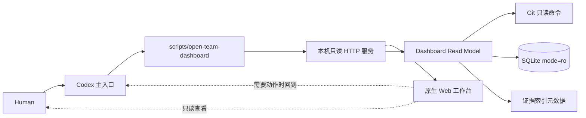

# MVP 1 本地只读工程工作台设计

> 日期：2026-08-09
>
> Dispatch ID：`20260809-001`
>
> 状态：Human 已确认推荐设计，待书面规范复核
>
> 风险等级：L2
>
> 设计基线：`afb4fa217162aaaca3658b177ff901346a43e7da`

## 1. 结论

MVP 1 建设一个由 Codex 启动、仅绑定本机、严格只读的 Web 工作台。它采用“异常优先”信息架构，先显示待审批、阻塞、失败、状态过期和数据不一致，再显示普通进度。Codex 继续作为唯一工程控制平面；浏览器只读取 Git 和 MVP 0 SQLite 状态，不修改 Git、不写数据库、不调用 Agent、不合并、不发布。

首版使用 Python 3 标准库和原生 HTML/CSS/JavaScript，不引入 Node、前端框架、云服务、账户系统或远程部署。这样能复用当前 Python 控制平面、降低本机安装和长期维护成本，并保持一条可测试的只读边界。

## 2. 背景与目标

MVP 0 已建立 Git、Worktree、SQLite 状态、状态机、审批、证据和 Doctor，但用户目前只能通过 Codex 查看已知任务，且稳定 CLI 没有全局任务列表。用户没有 VS Code 或 CLI 使用习惯，需要在 Codex 主入口之外有一个持续可见的本地工作台。

MVP 1 的目标是：

- 非技术用户通过浏览器查看项目健康和工程全生命周期；
- 异常和需要 Human 介入的事项在首页第一屏可见；
- 全局浏览项目、任务、Agent、审批、Review 和证据；
- 每个页面明确显示数据生成时间、来源 HEAD 和 schema 版本；
- 工作台故障、数据过期或状态不一致时显式告警，绝不伪装成实时正常；
- 用户只需在 Codex 说“打开工程工作台”，不需要自己执行命令。

## 3. 非目标

以下内容不属于 MVP 1：

- 从浏览器批准、暂停、继续、派活、修改状态或触发 Agent；
- 直接执行 Git、Worktree、合并、发布或回退；
- Codex App Server、MCP App 或原生嵌入 Codex；
- WebSocket、跨设备访问、多用户、登录、权限角色和远程部署；
- GitHub Remote 配置或首次推送；
- 云数据库、遥测、外部分析服务或自动更新；
- 展示凭据、Token、私钥、审批 nonce、敏感原文或任意文件内容；
- 移动端专用体验和复杂可视化报表。

## 4. 已选方案与备选方案

### 4.1 采用：Python 标准库服务 + 原生前端

- 后端使用 `http.server`、`sqlite3`、`json`、`subprocess` 等标准库；
- 前端为同源静态 HTML、CSS 和 JavaScript；
- 复用现有契约和状态定义，但建立独立只读查询层；
- 测试继续使用 `unittest`，不增加全局依赖。

优点是安装成本最低、边界容易审计、与 MVP 0 技术栈一致。代价是组件生态和开发便利度低于 React，但 MVP 1 的五类视图不需要前端框架。

### 4.2 未采用：React/Vite 单页应用

交互开发更快、组件生态更完整，但会引入 Node、构建链、依赖供应链和更多安装步骤。当前只读范围不足以证明这些成本合理。

### 4.3 未采用：立即接入 Codex App Server

更接近原生工作台，但会提前引入会话、审批、事件和兼容层，实际接口稳定性也需要单独验证。这属于 MVP 2/3，而不是 MVP 1。

## 5. 信息架构

### 5.1 全局导航

工作台提供五个一级视图：

1. **总览**：项目健康、异常队列、核心计数、主任务阶段和 Codex 建议；
2. **任务**：全局任务列表、筛选、搜索和任务详情；
3. **Agents**：执行者、Reviewer、模型、当前子任务、最后汇报和风险；
4. **审批**：待审批和历史审批，只提示回到 Codex 处理；
5. **证据**：测试、提交、差异、Review、批准和工件索引。

页面固定显示“只读”标识、当前来源 HEAD、最近成功刷新时间和数据健康状态。

### 5.2 总览：异常优先

首页第一屏按以下顺序展示：

1. 数据库不可用、HEAD 漂移、状态不一致或快照过期；
2. `NEEDS_HUMAN_APPROVAL`、`BLOCKED`、`NEEDS_DIRECTION`；
3. Review 为 `MODIFY / BLOCK / ESCALATE`；
4. Agent 长时间未汇报或任务没有下一步；
5. 正常进行中、最近完成和普通历史任务。

异常队列默认按风险等级、是否需要 Human、停滞时间和最近更新时间排序。页面可以建议“先处理什么”，但建议只由确定性规则生成，不声称替代 Codex 判断。

### 5.3 任务详情

任务详情包含：

- 标题、目标、风险等级、owner、executor 和生命周期状态；
- `task_base_sha`、`current_head_sha`、实际 HEAD、分支和 Worktree；
- 生命周期事件时间线；
- Agent、Blocker、Review、审批和证据摘要；
- HEAD 漂移、过期 Review、过期证据和有效验收状态；
- 当前下一步和“回到 Codex”提示。

首版数据库尚未持久化完整非目标和七问正文，工作台不得臆造；对应字段不存在时显示“派活工件中查看”或“当前控制库未记录”。

## 6. 系统架构



### 6.1 文件边界

计划中的职责边界如下：

- `team_control/dashboard_read_model.py`：只读打开数据库、查询和组合 API DTO；
- `team_control/dashboard_server.py`：HTTP 路由、同源检查、安全头、方法拒绝和静态文件服务；
- `apps/dashboard/index.html`：应用壳和语义结构；
- `apps/dashboard/styles.css`：异常优先桌面布局和响应式样式；
- `apps/dashboard/app.js`：路由、刷新、渲染和错误状态，不包含业务写操作；
- `scripts/open-team-dashboard`：由 Codex 调用的启动/打开入口；
- `tests/test_dashboard_read_model.py`：只读查询和状态聚合；
- `tests/test_dashboard_server.py`：HTTP 契约、安全和只读边界；
- `tests/test_dashboard_ui_contract.py`：静态资源、中文标签、可访问性和 API 映射契约。

这些文件均保持单一职责。HTTP 层不直接拼 SQL，前端不读取 SQLite，查询层不启动浏览器。

## 7. 只读数据模型

### 7.1 数据来源

- Git 是代码、分支和 HEAD 的事实源；
- Git common directory 下的 SQLite 是运行状态事实源；
- `artifacts/dispatches/` 中的工件只通过数据库证据索引暴露元数据；
- 工作台不扫描或返回任意文件正文。

### 7.2 数据库访问

工作台可以复用 `Store.from_repo(...).read_connection()` 的受控路径解析，但不得调用 `initialize()`、`mutation()`、状态转换或任何写接口。实施时要加固 `read_connection()`，并满足：

- 使用 SQLite URI `mode=ro` 打开既有数据库，不使用可能忽略 WAL 和锁的 `immutable=1`；
- 启用 `PRAGMA query_only = ON`，每个 API 请求建立独立连接和一个 `BEGIN` 只读快照，请求结束立即关闭；
- `ThreadingHTTPServer` 不共享 connection/cursor；连接和 busy timeout 均为 2 秒，超时返回 `503 DATABASE_BUSY`；
- 不执行 `CREATE`、迁移、补写、修复、缓存、checkpoint 或 journal mode 变更；
- 数据库不存在时返回结构化 `503 DATABASE_UNAVAILABLE`；
- schema 不兼容时返回 `503 SCHEMA_UNSUPPORTED`；
- 查询失败时关闭连接并返回错误，不降级为猜测数据。

MVP 0 数据库使用 WAL。Dashboard 的“只读”指不改变任何业务表、主数据库、WAL 内容、Git 或项目工件；SQLite reader 可以使用现有 `team.db-shm` 的瞬时锁协调区。为避免静默读取陈旧数据：

- `team.db`、`team.db-wal` 和 `team.db-shm` 必须经过 canonical path 与非符号链接检查；
- 当 `team.db-wal` 非空时，`-wal` 与 `-shm` 必须同时存在、是普通文件且当前用户可读，否则返回 `503 WAL_SIDECAR_UNAVAILABLE`；
- 不复制数据库、不使用 `immutable=1` 绕过 WAL、不自动创建或修复 sidecar；
- 无并发 writer 的测试中，读取前后业务表快照、主数据库与 WAL 的 SHA-256 必须一致；`-shm` 的锁区字节不作为业务状态哈希。

### 7.3 API 输出白名单

API 只返回界面所需字段。禁止返回：

- approval `nonce_hash`；
- 任何凭据、环境变量或 Git 配置值；
- 任意证据文件正文；
- SQLite 路径之外的本机路径枚举；
- operations 的内部请求参数或可能含敏感内容的原始 payload。

## 8. 只读 API

MVP 1 提供：

```text
GET /api/project
GET /api/tasks
GET /api/tasks/:dispatch_id
GET /api/tasks/:dispatch_id/events
GET /api/tasks/:dispatch_id/evidence
GET /api/approvals
GET /api/health
```

所有成功响应包含：

```json
{
  "schema_version": 1,
  "generated_at": "RFC3339 UTC timestamp",
  "source_head_sha": "full Git SHA",
  "data": {}
}
```

错误响应包含稳定的 `error.code`、可读消息、`generated_at`、`source_head_sha`（可获得时）和 `schema_version`。未知任务返回 `404 TASK_NOT_FOUND`。

`GET /api/tasks` 支持有限的确定性查询参数：`state`、`risk`、`attention` 和 `q`。未知参数或非法枚举返回 `400`，不静默忽略。首版不提供任意排序字段或 SQL 风格筛选。

`HEAD` 仅返回对应资源头；`OPTIONS` 只声明允许的只读方法。`POST`、`PUT`、`PATCH`、`DELETE` 和其他业务方法统一返回 `405 READ_ONLY`，且不能产生数据库、Git 或文件变化。

### 8.1 字段级响应契约

`data` 只允许包含以下字段；未列出的数据库列和内部 payload 不得透传：

| 端点 | `data` 字段 |
|---|---|
| `/api/project` | `repository_name`、`branch`、`head_sha`、`remote_configured`、`worktree_count`、`health`、`counts`、`attention_items` |
| `/api/tasks` | `items[]`、`limit`、`offset`、`has_more`；item 为 `dispatch_id`、`title`、`objective`、`risk_level`、`state`、`effective_state`、`owner`、`agent`、`updated_at`、`current_head_sha`、`attention_reasons[]` |
| `/api/tasks/:id` | `task`、`actual_head_sha`、`head_drift`、`valid_acceptance`、`agents[]`、`blockers[]`、`reviews[]`、`pending_approval_count`、`evidence_count`、`latest_event` |
| `/api/tasks/:id/events` | `items[]`、`limit`、`offset`、`has_more`；item 为 `sequence`、`event_type`、`created_at`、`summary`、`details` |
| `/api/tasks/:id/evidence` | `items[]`、`limit`、`offset`、`has_more`；item 为 `evidence_id`、`kind`、`relative_path`、`sha256`、`source_sha`、`created_at`、`stale` |
| `/api/approvals` | `items[]`、`limit`、`offset`、`has_more`；item 为 `approval_id`、`dispatch_id`、`action`、`target_sha`、`expires_at`、`consumed_at`、`status` |
| `/api/health` | `status`、`database`、`schema`、`git`、`warnings[]` |

`counts` 只包含 `active_tasks`、`blocked_tasks`、`pending_approvals`、`stale_reviews` 和 `stale_evidence`。Agent、Blocker 和 Review 子对象同样使用显式白名单，禁止返回原始 JSON 文本。

事件 `payload_json` 不直接返回。已知事件类型转换为固定 `summary` 和 allowlisted `details`；未知事件只返回 `sequence`、`event_type`、`created_at` 和空 `details`。

### 8.2 查询上限

- 列表端点接受整数 `limit` 和 `offset`；默认 `limit=50`，最大 `100`，`offset` 最大 `10000`；
- events 默认 `limit=100`，最大 `200`；
- 非整数、负数或超上限参数返回 `400 INVALID_PAGINATION`；
- `has_more` 通过多取一条计算，不执行无上限全表返回；
- 首页 `attention_items` 最多 20 条，普通计数使用聚合 SQL。

## 9. 刷新、过期与不一致

- 页面加载后立即获取快照，之后每 15 秒刷新一次；
- 连续 45 秒没有成功刷新即显示“数据已过期”；
- 浏览器离线或服务失败时保留最后一次成功数据，但顶部持续显示明显警告和该数据时间；
- `source_head_sha` 与当前主线 HEAD 不同、任务保存 HEAD 与实际 Worktree HEAD 不同、Review/Evidence 来源 SHA 与任务 HEAD 不同，分别标记漂移或过期；
- 不一致不会被自动修复，页面只解释影响并引导回到 Codex。

自动刷新只发 GET 请求。刷新间隔不提供任意用户输入，避免形成隐性负载或控制通道。

## 10. 本机和浏览器安全边界

- 服务默认且仅绑定 `127.0.0.1`；首版不提供 `--host 0.0.0.0`；
- 不配置通配 CORS；带 `Origin` 的请求必须与启动时的本机 origin 精确匹配，不匹配返回 `403 ORIGIN_REJECTED`；
- 无 `Origin` 的 `GET/HEAD` 只有在 Host 校验通过时允许，以支持同源导航、curl 和健康检查；`OPTIONS` 必须携带并通过 Origin 校验；
- 校验 Host，只接受启动时声明的 localhost/127.0.0.1 与端口；
- 返回 `Content-Security-Policy`、`X-Content-Type-Options: nosniff`、`Referrer-Policy: no-referrer` 和禁止嵌入的 frame 策略；
- 静态文件只允许 `/`、`/index.html`、`/styles.css` 和 `/app.js` 四个固定映射；其他路径一律 `404`，包含 `..`、编码斜杠或反斜杠的路径在映射前直接拒绝；
- 服务器不把访问日志写入项目或状态库；
- `scripts/open-team-dashboard` 不读取、打印或持久化敏感环境变量。

本机绑定不是认证系统。若未来需要局域网或远程访问，必须作为新的高风险设计处理，不能仅改变 host 参数。

### 10.1 Git 只读白名单

Dashboard 只能通过 `run_argv` 执行以下精确 Git argv，不允许 shell、alias、任意子命令或用户提供的参数：

```text
git rev-parse --show-toplevel
git rev-parse --git-common-dir
git rev-parse HEAD
git symbolic-ref --quiet --short HEAD
git status --porcelain=v1 --untracked-files=no --ignore-submodules=all
git worktree list --porcelain
git remote
```

所有调用设置 `GIT_OPTIONAL_LOCKS=0`，并通过命令行配置禁用 `core.fsmonitor` 和 `maintenance.auto`。工作台只返回 `remote_configured` 布尔值，不返回远端 URL。任务 Worktree HEAD 只可在数据库已登记、canonical 后位于本仓库 `.worktrees/` 的路径上执行同一 `rev-parse HEAD`。测试必须证明 `.git/index` 的 SHA-256 与 mtime、HEAD、refs 和 Git status 在请求前后不变。

## 11. 启动与使用体验

用户的正常入口是 Codex：

> 打开软件 AI 工程团队工作台。

Codex 核验仓库后调用 `scripts/open-team-dashboard`。脚本应：

1. 发现主仓库和 Git common directory；
2. 验证数据库存在且可只读打开；
3. 默认用 Git common directory 规范路径的 SHA-256 派生一个高位本机端口；测试可显式使用端口 `0`；
4. 输出结构化 URL，默认打开系统浏览器；
5. 默认端口已有服务时，只在 `/api/health` 的 `X-Team-Repository-ID` 与本仓库路径哈希完全一致时复用；不一致则 fail closed，不扫描或抢占其他端口；
6. 支持 `--no-open` 供自动化测试使用；
7. 服务停止后不留下数据库写入、Git 改动、PID/注册文件或项目日志。

`X-Team-Repository-ID` 只是在 loopback 响应中返回的本机路径 SHA-256，不返回原始路径。它只用于防止错误复用另一个仓库的服务，不是身份认证或访问令牌。

MVP 1 不承诺服务器永久后台运行。服务不可用时，用户回到 Codex 说“重新打开工作台”，由 Codex 重新核验并启动。

## 12. 错误与空态

必须实现并测试以下状态：

| 场景 | UI 行为 | API 行为 |
|---|---|---|
| 数据库不存在 | 全屏说明“控制状态库不可用，请回到 Codex” | `503 DATABASE_UNAVAILABLE` |
| 数据库为空 | 正常项目头 + “暂无任务” | `200`，空数组 |
| 无活跃任务 | 显示最近完成与空的异常队列 | `200` |
| Agent 阻塞 | 首页红色优先项，详情显示原因和 owner | `200` |
| 等待审批 | 首页琥珀色优先项，只提示回到 Codex | `200` |
| HEAD 漂移 | 顶部和任务详情显示不一致 | `200`，含 drift 标志 |
| 快照过期 | 保留旧数据并显示时间和离线告警 | 前端刷新失败 |
| schema 不兼容 | 停止展示可能误读的数据 | `503 SCHEMA_UNSUPPORTED` |
| 非 GET 业务请求 | 不改变任何状态 | `405 READ_ONLY` |

## 13. 可访问性和视觉要求

- 中文为默认界面语言；状态保留英文枚举并提供中文解释；
- 颜色不是唯一状态信号，同时使用文字、图标或标签；
- 主要导航、筛选和任务列表支持键盘操作与可见焦点；
- 使用语义化标题、导航、主内容、表格/列表和状态区域；
- 支持常用桌面宽度；1024px 以上为首要验收范围，较窄窗口仍可阅读；
- 不使用自动播放、复杂动画或依赖悬停才能看到的信息。

## 14. 测试与验收

### 14.1 自动化测试

- 查询层：空库、完整任务、异常排序、审批过滤、过期 Review/Evidence、HEAD 漂移；
- 数据库只读：无并发 writer 的 fixture 中，业务表快照、主数据库和 WAL 哈希在请求前后不变；允许 `-shm` 锁区参与 SQLite reader 协调；
- API：七个端点的 schema、状态码、过滤、未知参数和错误结构；
- 方法边界：`POST/PUT/PATCH/DELETE` 返回 `405`，没有副作用；
- 安全：localhost 绑定、Host/Origin 缺失与拒绝、安全响应头、静态固定映射和路径穿越拒绝；
- 并发：多个请求各自使用独立只读连接和快照，busy timeout 可预测；
- 上限：分页默认值、最大值、非法参数和 `has_more`；
- Git 只读：仅白名单 argv，`GIT_OPTIONAL_LOCKS=0`，请求前后 index hash/mtime、HEAD、refs 和 status 不变；
- UI 契约：五个视图、只读标识、刷新时间、来源 SHA、空态和错误态；
- 回归：现有 MVP 0 全量测试继续通过。

### 14.2 人工与独立验收

- Codex 用真实本地控制数据库运行一个只读演示；
- 验证首页第一屏优先显示阻塞和审批；
- 验证用户无需 VS Code/CLI，可从 Codex 打开页面；
- 验证页面没有可执行工程动作的控件；
- Claude Code 作为 L2 独立 Reviewer 审查架构、只读边界、实现、测试和残余风险；
- Claude 为 `MODIFY` 时回到同一 Worktree 修正并重新审查；未获独立 `ACCEPT` 不整合。

## 15. 完成标准

MVP 1 只有同时满足以下条件才可进入 `ACCEPTED`：

- 七个只读 API 和五类视图均已实现；
- Codex 一句话启动入口可用；
- 所有受影响测试在任务 Worktree 通过；
- 只读副作用测试证明业务表、主数据库、WAL、Git index/HEAD/refs/status 和项目工件不变，并单独记录 `-shm` 仅用于读锁协调的边界；
- 数据过期、数据库异常、状态不一致和空态均有明确表现；
- 关键安全边界经过测试；
- 独立 Reviewer 给出 `ACCEPT`；
- 验收证据写入 `artifacts/dispatches/20260809-001/`；
- Codex 在 `main` 整合后重新运行全量验证；
- Mimo 盘点完成，Codex 审阅后才关闭任务。

## 16. 实施顺序

1. 建立只读 DTO 与查询层；
2. 建立 API 服务和方法/同源/路径边界；
3. 建立异常优先的前端应用壳；
4. 完成任务、Agent、审批和证据视图；
5. 增加启动脚本和 Codex Skill 映射；
6. 完成错误态、安全、只读副作用和回归测试；
7. 真实本地演示、Claude 独立审阅、Codex 整合；
8. Mimo 盘点和受控知识回流。

## 17. 后续演进边界

MVP 2 才可设计前端操作意图、实时事件和 Codex Adapter。MVP 3 是否建设完整客户端，取决于多仓库、长期任务队列、复杂审批和 Codex App Server 稳定性等真实需求。MVP 1 的代码不得预埋绕过 Codex 的写接口。
