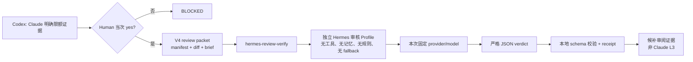

# Hermes 独立审核 Profile 设计

> 状态：Human 已确认方案 A；待实施
>
> 日期：2026-08-14
>
> Owner：Codex

## 1. 结论

建立全局 `hermes-review-verify`：由一个独立 Hermes 审核 Profile 调用 Human 已在该 Profile 中配置的任意模型。Qwen 3.7 Max 是初始建议默认值，不写死在运行器中。

该通道是 Claude Code 限额后的、经 Human 明确 `yes` 批准的一次性候补审阅，不等价于 Claude 的 L3 最终验收。CodeBuddy 保持封存，不参与路由。

## 2. 目标与非目标

目标：

- 让 Hermes 统一管理自定义 provider、模型与凭据；运行器不直接读取或保存凭据。
- 让每次审阅绑定明确的 `provider/model`、小型 immutable review packet、单次调用和严格 JSON verdict。
- 保持审核会话与日常 Hermes 记忆、规则、技能、工具、session 和 fallback 链隔离。
- 复用 V4 packet、预算、指纹、receipt 和 fail-closed 规则。

非目标：

- 不自动替代 Claude，不自动切换模型或重试。
- 不让审核模型扫描仓库、执行工具、写文件、访问 Vault 或读取完整 handoff。
- 不修改日常 Hermes 默认 Profile、模型选择、fallback 或凭据。
- 不将候补 `PASS` 标为 Claude L3 验收完成。

## 3. 架构



### 3.1 双层边界

| 层 | 职责 | 必须拒绝 |
|---|---|---|
| Hermes 审核 Profile | 保存并管理用户安装的模型/provider；只执行 one-shot 文本请求 | 日常 Profile、fallback、工具、技能、记忆、规则、恢复 session |
| `hermes-review-verify` 运行器 | packet、预算、单次指纹、输出校验、receipt、报告 | 自行读取凭据、直接 provider 调用、自动换模型、自动重试 |

### 3.2 模型策略

- 审阅请求显式指定 `provider/model`，并写入 fingerprint 与 receipt。
- 运行器只接受独立审核 Profile 已声明的模型；模型未注册、Profile 不匹配或 preflight 无法证明隔离时，一律 `BLOCKED`。
- 初始默认值为 `alibaba/qwen3.7-max`；后续新增模型只需在审核 Profile 内完成安装和预检，不改 V4 审核协议。
- 自动 fallback 是禁止项。模型失败、超时、空输出、非 JSON 或 schema 不符均终止本次请求，不能切到第二个模型。

## 4. 调用与数据契约

运行器只向 Hermes one-shot 传递由本地生成的 packet：

```text
review-manifest.json  base/head、范围、文件 SHA、测试摘要、3–5 条不变量
review.diff           仅目标 diff
review-brief.md       固定 JSON schema、风险类别、审阅问题
```

Lite 默认预算为 8k 输入 token / 1.2k 输出 token；Focused 为 15k / 2.5k。超限直接 `BLOCKED: context_too_large`，不得截断后继续调用。

模型只可返回：

```json
{
  "verdict": "PASS | PASS_WITH_WARNINGS | BLOCKED",
  "findings": [],
  "scope_ack": ["path/to/file"]
}
```

本地 schema 校验失败是 `P`（协议），不是模型发现；不会把原始模型文本投入下一轮。

## 5. 生命周期与失败处理

1. Codex 确认 Claude 返回明确 quota/rate-limit 证据，并在当前会话取得 Human `yes`。
2. 运行器预检审核 Profile、明确模型、无 fallback、无工具/规则/记忆/session、packet 预算和请求指纹。
3. 对同一指纹只进行一次 Hermes one-shot 调用。
4. 写入仅含安全字段的 receipt：preflight、packet 大小/估算、模型、event/response 事实、parse 状态、failure class 和 fingerprint。
5. 本地校验 verdict，产出候补审阅报告。

失败分类：`Q` 配额/限流、`T` 传输/超时、`P` Hermes 或 JSON 协议、`C` 上下文预算、`M` 模型明确 BLOCKED。任何失败均为 `BLOCKED: external_review_unavailable`；代码或 packet 改变前不得重试。

## 6. 验收与回滚

实施必须先以假 Hermes binary 做本地回归，覆盖：隔离参数、指定模型、拒绝 fallback、一次指纹、JSON 成功、空输出、超时、非 JSON、schema 不符、预算超限和安全 receipt 不泄露凭据。

首次真实 provider 使用只允许一次受控 canary：小 packet、无业务写入、Human 当次 `yes`。成功只证明该候补通道可用，不改变 Claude 的最终验收地位。

回滚仅移除全局 `hermes-review-verify` 路由或禁用该审核 Profile；不触碰日常 Hermes 配置，也不恢复 CodeBuddy。
